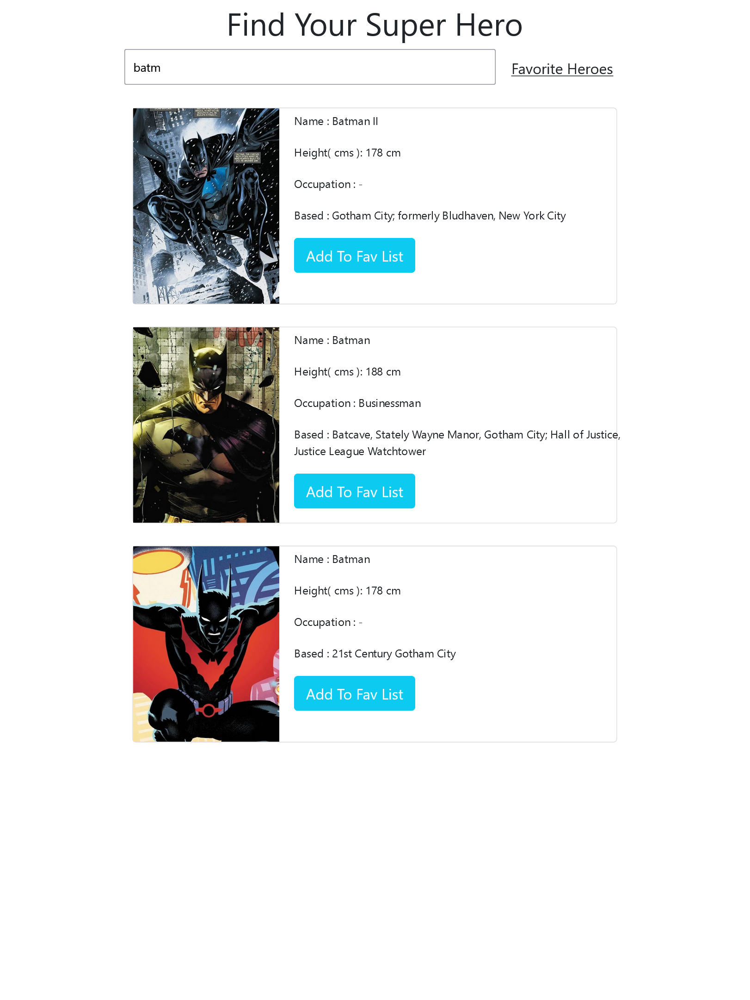
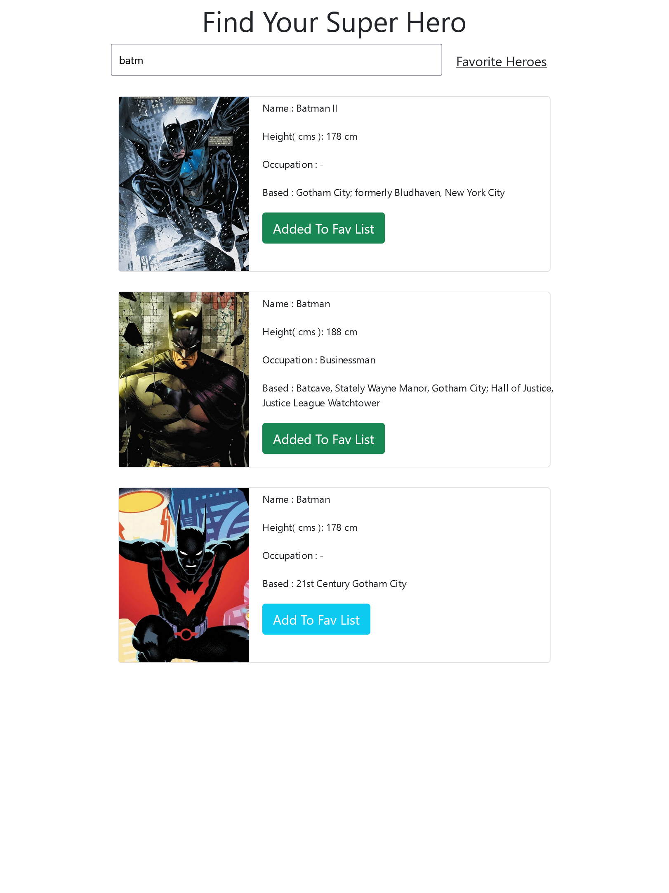
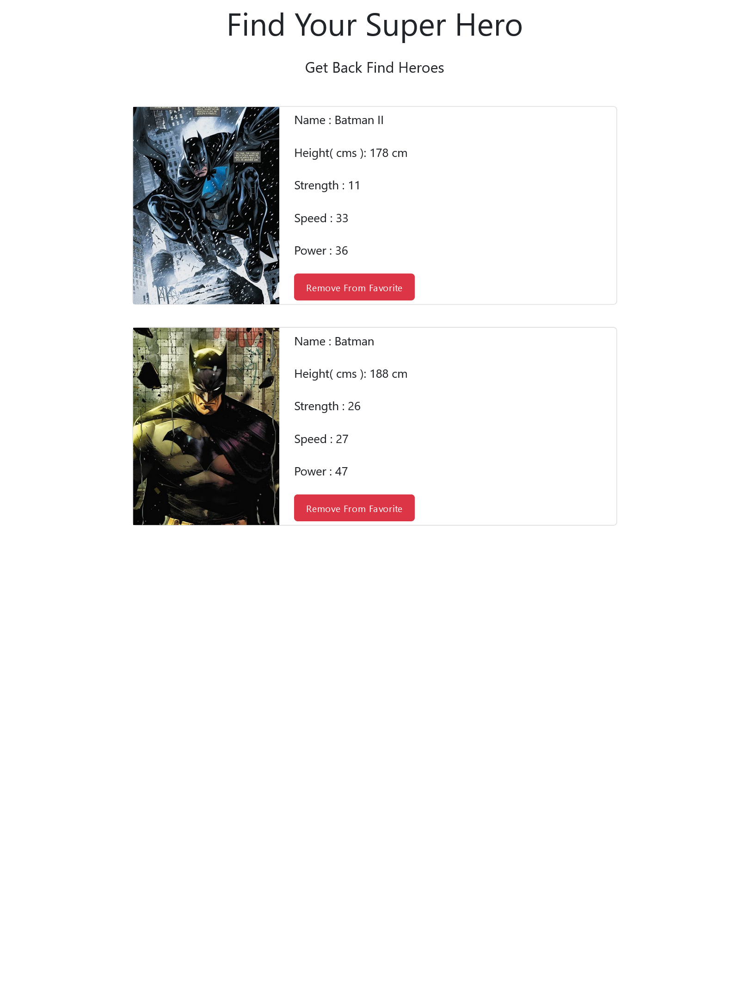
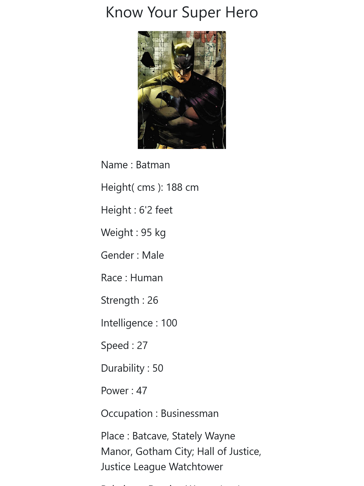

# Hosted Link
https://manishbittu0999.github.io/FE-Super-Hero-Hunter-Api/

# The Superhero Guide

User of this app can find his/her Superhero can know more about his/her hero for e.g if a user want to know about batman user will get all the information about batman available on internet.
Also User can make specific hero favourite & can see all favourite heroes at one place

    

## Screenshots

    This is how it looks when its launch or in idle state 

    This is how the results are going to be shown

    Added to favourite

    List of favourite heroes

    More Information About The Hero 

## Pages & Features

- Home Page
    - Search any superhero by just typing initials of the superhero and display the search results on the homepage itself
    - Each search result of the superhero has a favourite button, clicking on which the superhero should be added to “My favourite superheroes” (a list).
    - On clicking any particular search result (any superhero), it opens up a new page with more information about that superhero.

- Superhero Page
    - this page shows a lot of information about the superhero like their name, photo, powerstats, bio.

- My favourite superheroes Page
    - Display a list of all the favourite superheroes.
    - This list is persistent (it will have the same number of superheroes before and after closing the browser).
    - There is a remove from the list of favourite heroes button: Each superhero has remove from favourites button, clicking on which should remove that superhero from the list.

## Technology Used

- HTML
- CSS
- JAVASCRIPT
- BOOTSTRAP 5 ( css framework )
## Author

- Manish Gupta
